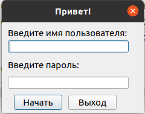

client package
==============

Клиентское приложение для обмена сообщениями. Поддерживает
отправку сообщений пользователям которые находятся в сети, сообщения шифруются
с помощью алгоритма RSA с длинной ключа 2048 bit.

Примеры использования:

* ``python3 client.py``

Запустит клиентский сервер со стандартными настройками - адрес 127.0.0.1, порт - 7777

*Запуск приложения с другими настройками*

* ``python3 127.0.0.10 9999``

*Окно авторизации:*

Submodules
----------

client.client module
--------------------

.. automodule:: client.client
   :members:
   :undoc-members:
   :show-inheritance:

client.client\_database module
------------------------------

.. automodule:: client.client_database
   :members:
   :undoc-members:
   :show-inheritance:

client.client\_gui module
-------------------------

.. automodule:: client.client_gui
   :members:
   :undoc-members:
   :show-inheritance:

client.main\_window\_conv module
--------------------------------

.. automodule:: client.main_window_conv
   :members:
   :undoc-members:
   :show-inheritance:

client.start\_dialog module
---------------------------

.. automodule:: client.start_dialog
   :members:
   :undoc-members:
   :show-inheritance:

Module contents
---------------

.. automodule:: client
   :members:
   :undoc-members:
   :show-inheritance:
